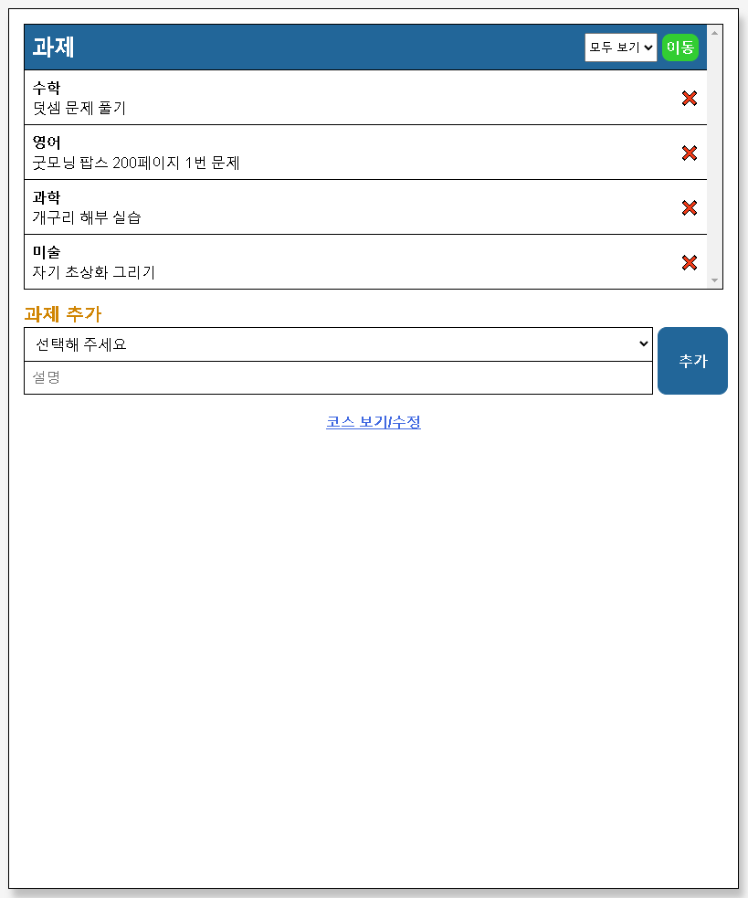
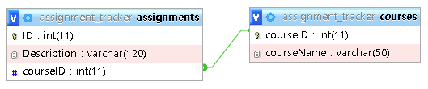

## Create a PHP Application | PHP MVC Project Tutorial

1. <https://www.youtube.com/watch?v=Rkg731t47dc&t=1204s>

2. <https://youtu.be/LcCpd3_xa8E>



### MySQL 구조



### 전체 구조

```
mvc
├─ .gitignore
├─ index.php
├─ model
│  ├─ assignments_db.php
│  ├─ course_db.php
│  └─ database.php
├─ README.md
├─ sass
│  ├─ main.scss
│  ├─ _add.scss
│  ├─ _base.scss
│  ├─ _colors.scss
│  ├─ _list.scss
│  └─ _mixins.scss
├─ screenshot.png
├─ sql
│  └─ assignment_tracker.sql
├─ sql.png
└─ view
   ├─ assignment_list.php
   ├─ course_list.php
   ├─ css
   │  └─ main.min.css
   ├─ error.php
   ├─ footer.php
   └─ header.php
```

### 개발 환경

1. 윈도우 10 프로
2. XAMPP 8.1.2
3. Visual Studio Code

### 코드 사용법

1. GIT CLONE 또는 ZIP 파일 다운로드
2. 다운받은 소스 폴더명은 mvc로 이름 변경
3. xampp/htdocs 폴더 안에 다운 받은 코드 풀기
4. XAMPP Control Panel 실행 후 Apache와 MySQL Start
5. 다운받은 소스에 들어있는 sql 폴더의 assignment_tracker.sql를 MySQL로 가져오기
6. 브라우저 실행후에 주소창에 http://localhost/mvc 입력
